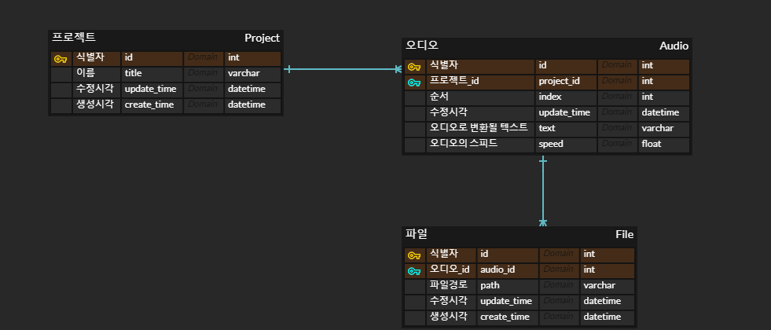

# 소개

- TTS(텍스트를 음성으로 변환) 서비스를 사용자에게 제공하고자 합니다.

# 설계

## 모델링

### ERD

  

### Audio

- field
    - id
    - index: 텍스트의 순서를 뜻함
    - update_time: 최신 업데이트 시간을 반영
    - text : 오디오로 변환될 텍스트
    - speed : 오디오의 스피드
    - project_id : 오디오를 내포한 프로젝트의 식별자

### Project

- field
    - id
    - index: 텍스트의 순서를 뜻함
    - title : 프로젝트의 이름
    - update_time
    - create_time

### FIle

- field
    - id
    - path
    - audio_id(fk)

## 기능 구현

- 프로젝트 생성(오디오 생성)
    1. 텍스트(str)가 담긴 리스트를 받습니다. (length = 1)
    2. 이를 전처리하여 오디오를 생성하는 함수의 input으로 같이 넣습니다. [['text1', 'text2', 'text3', ....], path]
    3. 일정시간 이후 함수에서 (id, text)형태의 원소를 가진 리스트를 리턴합니다. [('id1' ,'text1'), ('id2', 'text2'), ('id3', 'text3'), ....]
    4. 오디오는 input의 path에 저장됩니다.

## API

- `POST` **/api/tts/project**: 프로젝트 생성(오디오 생성)
    1. 텍스트(str)가 담긴 리스트를 받습니다. (length = 1)
    2. 이를 전처리하여 오디오를 생성하는 함수의 input으로 같이 넣습니다. [['text1', 'text2', 'text3', ....], path]
    3. 일정시간 이후 함수에서 (id, text)형태의 원소를 가진 리스트를 리턴합니다. [('id1' ,'text1'), ('id2', 'text2'), ('id3', 'text3'), ....]
    4. 오디오는 input의 path에 저장됩니다.

- `GET` **/api/tts/project/:id/index/:index**: 텍스트 조회
    - 특정 프로젝트의 n번째 페이지를 조회합니다.
    - 한페이지는 10문장으로 이루어져 있습니다.

- `PUT/PATCH` **/api/tts/audio/:id**: 텍스트 수정
    - 한 문장의 텍스트와 스피드를 수정합니다.

- `GET` **/api/tts/audio/:id**: 오디오파일 송신
    - 요청받은 오디오파일을 송신한다.

- `POST` **/api/tts/audio/:id**: 텍스트(오디오) 생성 / 삭제
    - 삽입위치는 항상 앞, 뒤가 아닌 중간도 가능

- `DELETE` **/api/tts/project/:id**: 프로젝트 삭제

